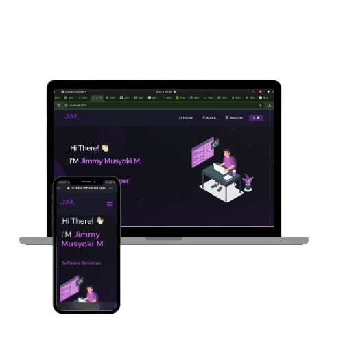

<h2 align="center">
  Portfolio Website - v2.0 
  <a href="https://https://my-portfolio-ten-theta-55.vercel.app/" target="_blank">yourwebsite.com</a>
</h2>

  

 

  <!-- Card 1 -->
  

    <h3 style="color: #f44336; margin: 0;">❤️ Made with Love</h3>
    
Code is like humor. When you have to explain it, it’s bad. 😄

  

  <!-- Card 2 -->
  

    <h3 style="color: #ffeb3b; margin: 0;">💻 Made with JavaScript</h3>
    
Why did the JavaScript developer go broke? Because he didn’t know how to "null" his problems. 😂

  

  <!-- Card 3 -->
  

    <h3 style="color: #4caf50; margin: 0;">🌟 Open Source</h3>
    
Remember: Open source isn't free labor; it's powered by passion. ❤️

  

  <!-- Card 4 -->
  

    <h3 style="color: #2196f3; margin: 0;">⭐ GitHub Stars</h3>
    
Fun fact: A GitHub star a day keeps the bugs away! ✨

  

  <!-- Card 5 -->
  

    <h3 style="color: #9c27b0; margin: 0;">🍴 GitHub Forks</h3>
    
Fork responsibly! You might just create something amazing. 🍴

  

<h3 align="center">
    🔹
    <a href="mailto:jimmy.mulundi@gmail.com?subject=Report%20Bug">Report Bug</a> &nbsp; &nbsp;
    🔹
    <a href="mailto:jimmy.mulundi@gmail.com?subject=Request%20Feature">Request Feature</a>
</h3>

## TL;DR

You can fork this repo to modify and make changes of your own. Please give me proper credit by linking back to [My GitHub](https://https://github.com/JimmyMusyoki/My-portfolio). Thanks!

## Built With

My personal portfolio <a href="https://https://my-portfolio-ten-theta-55.vercel.app" target="_blank">yourwebsite.com</a> which features some of my GitHub projects as well as my resume and technical skills. 

This project was built using these technologies:

- React.js
- Node.js
- Express.js
- CSS3
- VsCode
- Vercel

## Features

**📖 Multi-Page Layout**

**🎨 Styled with React-Bootstrap and CSS with easy-to-customize colors**

**📱 Fully Responsive**

## Getting Started

Clone down this repository. You will need `node.js` and `git` installed globally on your machine.

## 🛠 Installation and Setup Instructions

1. Installation: `npm install`

2. In the project directory, you can run: `npm start`

Runs the app in development mode.  
Open [http://localhost:3000](http://localhost:3000) to view it in the browser.  
The page will reload if you make edits.

## Usage Instructions

Open the project folder and navigate to `/src/components/`.  
You will find all the components used, and you can edit your information accordingly.

### Connect with me  

- **GitHub:** [JimmyMusyoki](https://github.com/JimmyMusyoki)  
- **LinkedIn:** [jimmymusyoki](https://www.linkedin.com/in/jummymusyoki)  
- **Twitter:** [@is.jimmie](https://twitter.com/is.jimmie)  
- **instagram** [@is.jimmie](https://instagram.com/is.jimmie)  
- **Email:** [jimmy.mulundi@gmaill.com](mailto:your-jimmy.mulundi@gmail.com)  

---

Feel free to reach out to me for collaborations or feedback!
